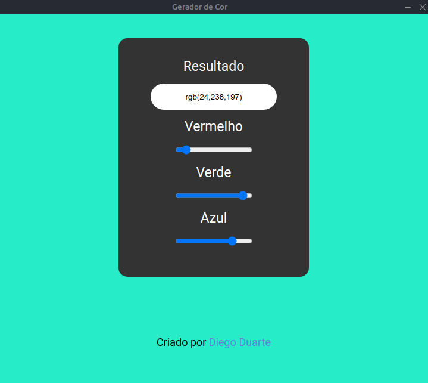

<br><br>

<p align="center">
  
</p>

<h2 align="center">Gerador de cor feito com framework electronjs e compilado com electron forge</h2>

<br><br>

<p align="center">
  </p>

<br>


Esse repositório foi criado para compartilhar o que eu aprendo estudando a framework electron, abaixo eu deixo vários links de referência que me ajudaram na criação da minha aplicação.
Para fazer building da minha aplicação eu utilizei o electronforge foi o que eu me adaptei melhor mas existem outras ferramentas tais como:

- [Electron Forge](https://github.com/electron-userland/electron-forge)
- [Electron Builder](https://github.com/electron-userland/electron-builder)
- [Electron Packager](https://github.com/electron/electron-packager)

<br>

### Iniciando novo projeto com Electron Forge

~~~
npx create-electron-app nome-app
~~~

### Estrutura do Electron Forge

```text

nome-app/
├── node_modules
├──src
│  ├── index.css
│  ├── index.html
│  └── index.js
├──.git
├──package.json
├──package-lock.json
└──.gitignore

```

### Comando para rodar app

```text
npm start
```

### Comando para compirar app

```text
npm run make
```

### Adicionando icone da aplicação no linux.
Dentro do arquivo "package.json" adicionar a linha 
```text
"icon": "./src/icon.png"
```


<br>

Exemplo:

~~~javascript
 {
          "name": "@electron-forge/maker-deb",
          "config": {
            "icon": "./src/icon.png"
          }
        },
        {
          "name": "@electron-forge/maker-rpm",
          "config": {
            "icon": "./src/icon.png"
          }
~~~

<br><br>

### Referências

- [Node.JS](https://nodejs.org/en/docs/)
- [Electron Wiki](https://www.electronjs.org/docs)
- [Electron Quick Start](https://www.electronjs.org/docs/tutorial/quick-start)
- [Electron Forge](https://github.com/electron-userland/electron-forge)
- [Forge Config](https://www.electronforge.io/configuration)
- [Electron Forge Building](https://www.electronforge.io/)

<br><br>